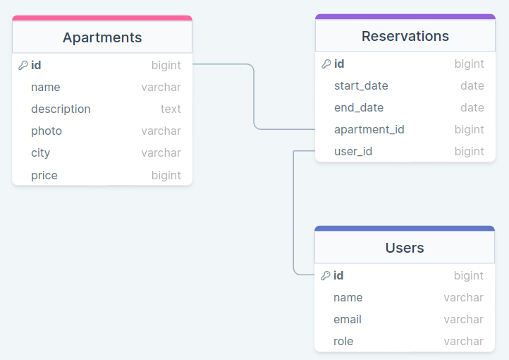

# 📗 Table of Contents

- [📖 About the Project](#about-project)
  - [🛠 Built With](#built-with)
    - [Tech Stack](#tech-stack)
    - [Key Features](#key-features)
  - [🚀 Live Demo](#live-demo)
  - [📊 ERD Diagram](#erd-diagram)
- [💻 Getting Started](#getting-started)
  - [Setup](#setup)
  - [Prerequisites](#prerequisites)
  - [Install](#install)
  - [Usage](#usage)
  - [Run tests](#run-tests)
  - [Deployment](#deployment)
- [👥 Authors](#authors)
- [🔭 Future Features](#future-features)
- [🤝 Contributing](#contributing)
- [⭐️ Show your support](#support)
- [🙏 Acknowledgements](#acknowledgements)
- [❓ FAQ (OPTIONAL)](#faq)
- [📝 License](#license)

# 📖 Apartment reservation <a name="about-project"></a>

**Apartment reservation** is an application that allows users to rent apartments all over the world.

## 🛠 Built With <a name="built-with"></a>

### Tech Stack <a name="tech-stack"></a>

<details>
  <summary>Client</summary>
  <ul>
    <li><a href="https://react.dev/">React</a></li>
  </ul>
</details>

<details>
  <summary>Server</summary>
  <ul>
    <li><a href="https://rubyonrails.org/">Ruby on Rails</a></li>
  </ul>
</details>

<details>
<summary>Database</summary>
  <ul>
    <li><a href="https://www.postgresql.org/">PostgreSQL</a></li>
  </ul>
</details>

### Key Features <a name="key-features"></a>

- **User Sign-up and Sign-in**
- **Add, remove apartment**
- **Add, remove reservation**

<p align="right">(<a href="#readme-top">back to top</a>)</p>

## 🚀 Live Demo <a name="live-demo"></a>

- [Live Demo Link](https://google.com)

<p align="right">(<a href="#readme-top">back to top</a>)</p>

## 📊 ERD Diagram <a name="erd-diagram"></a>

This is the base ERD diagram for this project



<p align="right">(<a href="#readme-top">back to top</a>)</p>

## 💻 Getting Started <a name="getting-started"></a>

To get a local copy up and running, follow these steps.

### Prerequisites

In order to run this project you need:

<!--
Example command:

```sh
 gem install rails
```
 -->

### Setup

Clone this repository to your desired folder:

```sh
  git https://github.com/BucurEva87/apartment-reservation-front-end.git
  cd apartment-reservation-front-end
```

### Install

Install this project with:

<!--
Example command:

```sh
  cd my-project
  gem install
```
--->

### Usage

To run the project, execute the following command:

<!--
Example command:

```sh
  rails server
```
--->

### Run tests

To run tests, run the following command:

<!--
Example command:

```sh
  bin/rails test test/models/article_test.rb
```
--->

### Deployment

You can deploy this project using:

<!--
Example:

```sh

```
 -->

<p align="right">(<a href="#readme-top">back to top</a>)</p>

## 👥 Authors <a name="authors"></a>

👤 **Abdallah Antony**

- GitHub: [@abdallahmalima](https://github.com/abdallahmalima)
- Twitter: [@softmal1](https://twitter.com/Softmal1)
- LinkedIn: [Abdallah Antony](https://www.linkedin.com/in/abdallah-malima-antony/)

👤 **Eva-Lavinia Bucur**

- GitHub: [@BucurEva87](https://github.com/BucurEva87)
- Twitter: [@BucurEva](https://twitter.com/BucurEva)
- LinkedIn: [Eva-Lavinia Bucur](https://www.linkedin.com/in/eva-lavinia-bucur)

👤 **Jonathan Munamire**

- GitHub: [@jonathanmunamire](https://github.com/jonathanmunamire)
- Twitter: [@amanimunamire](https://twitter.com/amanimunamire)
- LinkedIn: [Jonathan Munamire](https://www.linkedin.com/in/jonathanmunamire/)

👤 **Sergiy Shkolnik**

- GitHub: [SergSkol](https://github.com/SergSkol)
- Twitter: [@sps676](https://twitter.com/sps676)
- LinkedIn: [SergSkol](https://www.linkedin.com/in/sergskol/)

👤 **KIDDE GEORGE WILLIAM**

- GitHub: [@githubhandle](https://github.com/kidde60)
- Linkedin: [@linkedinhandle](https://www.linkedin.com/in/george-william-kidde/)
- Twitter: [@twitterhandle](https://twitter.com/KGWilliam60)

<p align="right">(<a href="#readme-top">back to top</a>)</p>

## 🔭 Future Features <a name="future-features"></a>

> Describe 1 - 3 features you will add to the project.

- [ ] **Add more tests**
- [ ] **Add statistics**
- [ ] **Add photo2, 3, etc**

<p align="right">(<a href="#readme-top">back to top</a>)</p>

## 🤝 Contributing <a name="contributing"></a>

Contributions, issues, and feature requests are welcome!

Feel free to check the [issues page](../../issues/).

<p align="right">(<a href="#readme-top">back to top</a>)</p>

## ⭐️ Show your support <a name="support"></a>

If you like this project, please give us a star. It would (and will) be highly appreciated! ^\_^

<p align="right">(<a href="#readme-top">back to top</a>)</p>

## 🙏 Acknowledgments <a name="acknowledgements"></a>

Project's theme inspired by [Murat Korkmaz](https://www.behance.net/muratk)'s [Vespa Responsive Redesign](https://www.behance.net/gallery/26425031/Vespa-Responsive-Redesign)

<p align="right">(<a href="#readme-top">back to top</a>)</p>

## 📝 License <a name="license"></a>

This project is [MIT](./LICENSE) licensed.

<p align="right">(<a href="#readme-top">back to top</a>)</p>
